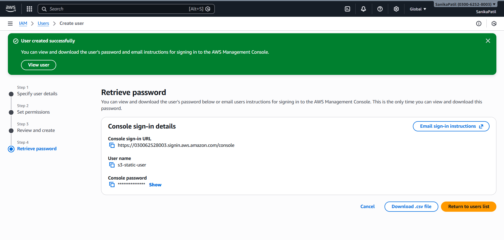
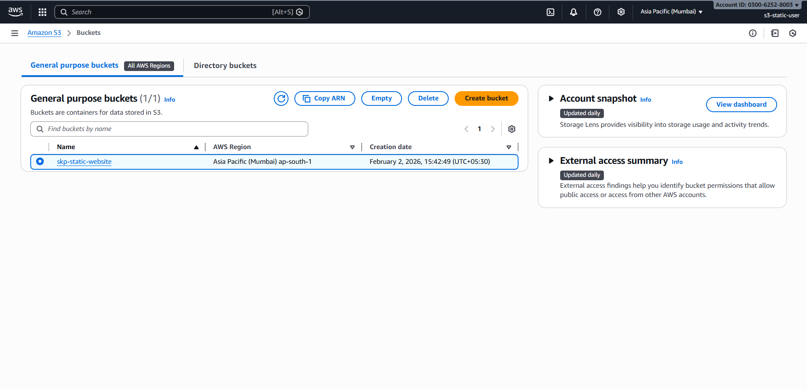
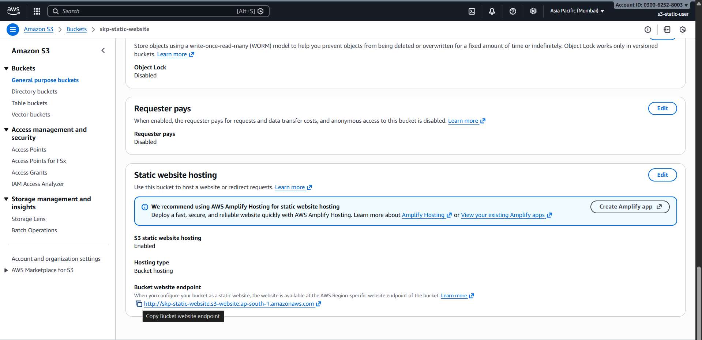
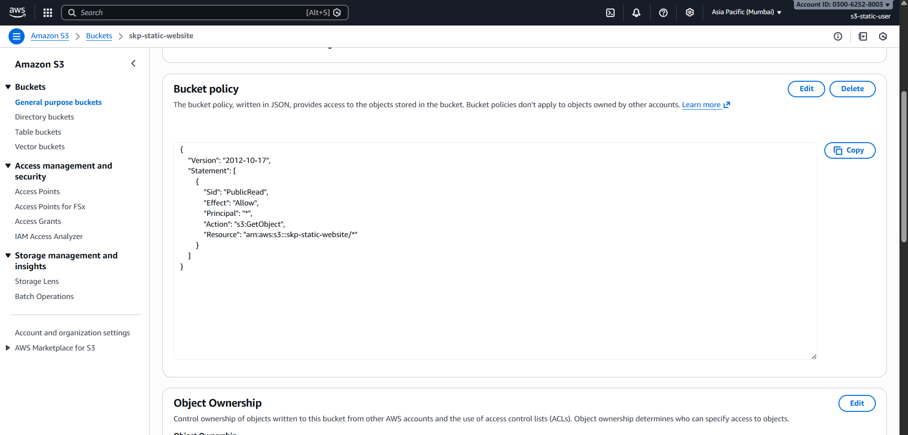
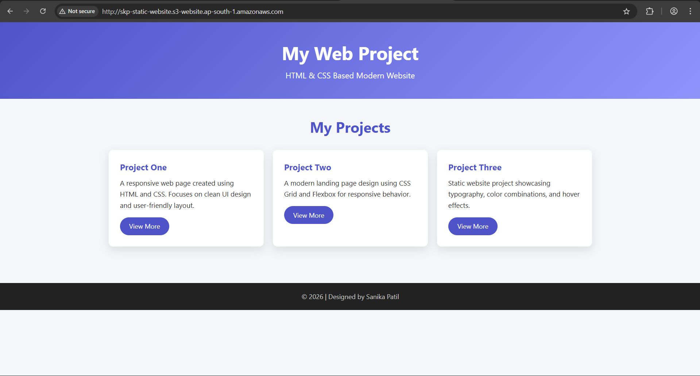

# Static Website Hosting on AWS S3

## Project Overview
This project demonstrates how to host a static website on Amazon S3 using AWS services such as IAM and S3.

The objective of this project is to understand static website hosting, IAM user management, and public access configuration in AWS.

---

## Services Used
- AWS IAM
- Amazon S3
- HTML (Static Website)

---

## Project Steps

### 1. IAM User Creation
- Created a dedicated IAM user for the project.
- Assigned AmazonS3FullAccess policy.
- Logged in using IAM user credentials instead of root account.

### 2. S3 Bucket Creation
- Created an S3 bucket with a globally unique name.
- Selected region: ap-south-1 (Mumbai).

### 3. Public Access Configuration
- Disabled "Block all public access" for the bucket.
- Confirmed public access warning.

### 4. Static Website Hosting
- Enabled static website hosting from bucket properties.
- Configured index document as `index.html`.

### 5. Upload Website Files
- Uploaded `index.html` file to the S3 bucket.

### 6. Bucket Policy Configuration
- Added a bucket policy to allow public read access (s3:GetObject).
- Ensured users can view website content without authentication.

### 7. Website Testing
- Accessed the website using the S3 static website endpoint.
- Verified successful website rendering without access denied errors.

---

## Proof of Execution

### IAM User Created

### S3 Bucket Created

### Static Website Hosting Enabled

### Bucket Policy Configuration

### Website Output

---

## Learning Outcomes
- Learned static website hosting using Amazon S3.
- Understood IAM user and permission management.
- Gained hands-on experience with public access configuration.
- Learned basic cloud hosting concepts.

---

## Author
**Sanika Kumar Patil**
